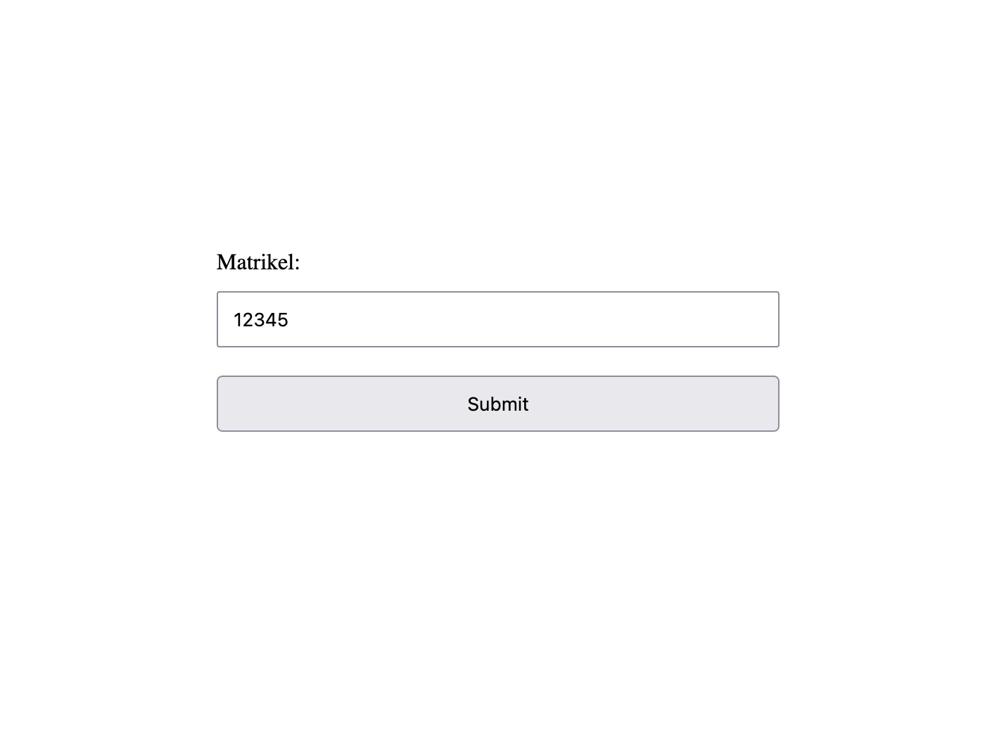

# Grading app
Small app in flask displaying student grades.

### Add CSV in this format:
| First name | Surname | Student ID | Grade 1a | Grade 1b | ... | Grade | Total | Percentage |
|------------|---------|------------|----------|----------|-----|-------|-------|------------|
|            |         |            |          |          |     |       |       |            |
|            |         |            |          |          |     |       |       |            |

### Initial screen:

### Output screen with grades:

